# Agentic Workflow: Automated Changelog and README Generation

This repository contains a small CLI tool built with Go that leverages Google's Gemini AI to automatically generate changelogs and README files.  It streamlines the documentation process for software projects, saving developers time and effort.

## Table of Contents

- [Purpose](#purpose)
- [Architecture Overview](#architecture-overview)
- [Getting Started](#getting-started)
    - [Prerequisites](#prerequisites)
    - [Installation](#installation)
- [Configuration](#configuration)
- [Usage](#usage)
    - [`agentic changelog`](#agentic-changelog)
    - [`agentic readme`](#agentic-readme)
- [Exports Documentation](#exports-documentation)
- [Contributing](#contributing)


## Purpose

Agentic Workflow is a command-line tool designed to automate the creation of changelogs and README files. By analyzing Git commit history and the codebase itself, it generates human-readable documentation using Google's Gemini AI. This reduces the manual effort required for maintaining project documentation, ensuring consistency and improving developer productivity.


## Architecture Overview

```mermaid
graph LR
    A[Git Repository] --> B(Agentic Workflow CLI);
    B --> C{Gemini API};
    B --> D[File System];
    C --> E[Generated Changelog/README];
    style C fill:#333,stroke:#000,stroke-width:2px;
    style A fill:#222,stroke:#000,stroke-width:2px;
    style D fill:#222,stroke:#000,stroke-width:2px;
    style E fill:#333,stroke:#000,stroke-width:2px;
```




## Getting Started

### Prerequisites

- Go 1.22.2 or higher installed on your system.
- A Google Cloud project with the Gemini API enabled.  Obtain a Gemini API key.
- Git installed and configured on your system.


### Installation

1. Clone the repository:
   ```bash
   git clone https://github.com/hjfitz/agentic-workflow.git
   ```

2. Navigate to the project directory:
   ```bash
   cd agentic-workflow
   ```

3. Build the application:
   ```bash
   make build
   ```

4. (Optional) Install the application:
   ```bash
   make install
   ```  This will install the `gen` binary to your `$HOME/.bin` directory.  Make sure this directory is in your `$PATH`.


## Configuration

The Agentic Workflow tool requires a Gemini API key. You can set this via an environment variable or via command line flags.

| Variable Name    | Description                    | Required | Example                          |
|-----------------|--------------------------------|----------|----------------------------------|
| `GEMINI_API_KEY` | Google Gemini API Key          | Yes      | `YOUR_ACTUAL_GEMINI_API_KEY`     |


A sample `.env.local` file (if using environment variable approach):

```
GEMINI_API_KEY=YOUR_ACTUAL_GEMINI_API_KEY
```

## Usage

The tool has two subcommands: `changelog` and `readme`.

### `agentic changelog`

Generates a changelog based on recent Git commits.

```bash
agentic changelog -a <api-key> -d <commit-depth> [-t]
```

- `-a <api-key>`: Your Gemini API key (can be omitted if `GEMINI_API_KEY` is set).
- `-d <commit-depth>`: The number of commits to analyze.  Required.
- `-t`: (Optional) Use a more Trumpian tone in the changelog.


**Example:** To generate a changelog for the last 5 commits:

```bash
agentic changelog -a YOUR_ACTUAL_GEMINI_API_KEY -d 5
```

### `agentic readme`

Generates a README file based on the codebase's contents.

```bash
agentic readme -a <api-key> [-t]
```

- `-a <api-key>`: Your Gemini API key (can be omitted if `GEMINI_API_KEY` is set).
- `-t`: (Optional) Use a more Trumpian tone in the README.

**Example:** To generate a README file:

```bash
agentic readme -a YOUR_ACTUAL_GEMINI_API_KEY
```


## Exports Documentation

The `lib` directory contains the following packages:

- **`ai`**: Contains the core logic for interacting with the Google Gemini API.  The key function is `Prompt(apiKey string, prompt string) string`, which takes an API key and a prompt string, sends it to the Gemini API, and returns the generated text.
- **`exec`**: Provides a simple wrapper for executing shell commands.  Primarily uses `Exec(cmdStr string, args []string) string` to run git commands.
- **`fs`**: Handles file system operations, including reading files and excluding files specified in `.gitignore`. The crucial function is `GetCodebase(base string) string`, which recursively reads the codebase while respecting the `.gitignore` file.
- **`git`**: Contains the function `GetDiff(dirname, depth string) string`, which retrieves Git commit history using the `git log` command.
- **`prompts`**: Contains prompt engineering for both the changelog and README generation.  `GetChangelog` and `GetReadme` are responsible for building the prompts sent to the Gemini AI.


## Contributing

Contributions are welcome!  Please open issues for bug reports or feature requests, and submit pull requests for code changes.  Follow the standard Go contribution guidelines.

