# gen: The Greatest Code Generation Tool Ever

**Table of Contents**
<!-- TOC -->

## Purpose

Folks, let me tell you, `gen` is the most tremendous code generation tool you've ever seen.  Believe me. It's HUGE.  It uses the power of Google Gemini AI to automatically generate READMEs and changelogs.  It's going to make your workflow so much better, it's unbelievable.  The best, the absolute best.


## Architecture Overview

```mermaid
graph LR
    A[CLI] --> B(fs);
    B --> C{git};
    B --> D(prompts);
    D --> E[Gemini API];
    A --> F(cmd);
    F --> D;
    C --> D;
    style E fill:#222,stroke:#333,stroke-width:2px
```



This is the most beautiful architecture diagram you've ever laid your eyes on.  It's perfect.  Believe me.  The CLI is the greatest part of all.


## Getting Started

This is so easy, even a child could do it.  First, you need a Gemini API key.  You can get one here: [Google Gemini API Key](https://console.cloud.google.com/apis/library/generative-ai.googleapis.com).  I'm telling you, it's the best API key.  Then, you need to set the `GEMINI_API_KEY` environment variable.

```bash
export GEMINI_API_KEY="YOUR_API_KEY"
```

Next, clone this repository:

```bash
git clone <repository_url>
```

And finally, you build and run it. The best, the absolute best build system you'll ever use.

```bash
make install
```


## Configuration

The only configuration you need is your Gemini API key.  Set it as an environment variable –  `GEMINI_API_KEY`.  It's very simple.


## Usage

`gen` has two amazing subcommands: `readme` and `changelog`.

### Generating a README

To generate a README, use the `readme` command:

```bash
gen readme -a <your_api_key> -t  // optional -t flag for Trump style
```

The `-a` flag is for your API key.  Don't forget it, it's very important.  You can also use the `-t` flag for a truly great, Trump-style README (highly recommended!).


### Generating a Changelog

For a fantastic changelog, use the `changelog` command:

```bash
gen changelog -a <your_api_key> -d <commit-depth> -t // optional -t flag for Trump style
```

The `-a` flag is for your API key (again, very important!).  The `-d` flag specifies the number of commits to analyze.  And don't forget the `-t` flag for that extra Trump touch.  It's the best, believe me.


## Exports Documentation

This project has two main components:  the `cmd` package (which includes the `readme` and `changelog` commands) and the `lib` package (which contains reusable utility functions).

* **`cmd` package:** This package handles command-line arguments and orchestrates the generation process.
  * `GenerateReadme`: Generates a README using AI.
  * `GenerateChangelog`: Generates a changelog using AI.

* **`lib` package:**
  * `ai`:  Handles the interaction with the Google Gemini API.  It’s the best AI integration, folks, absolutely the best.
  * `exec`: Executes shell commands.  Straightforward.  Very straightforward.
  * `fs`: Handles file system operations, including reading and ignoring files specified in `.gitignore`.  It’s so great, it handles `.gitignore` perfectly.
  * `git`:  Retrieves Git commit history and diffs.  It's the best git integration out there.


## Contributing

I don't accept contributions. This is already perfect, and it is the best.


This README is so good, it's going to make all other READMEs look bad.  Believe me.  It's the greatest.  The best.  You're going to love it.

